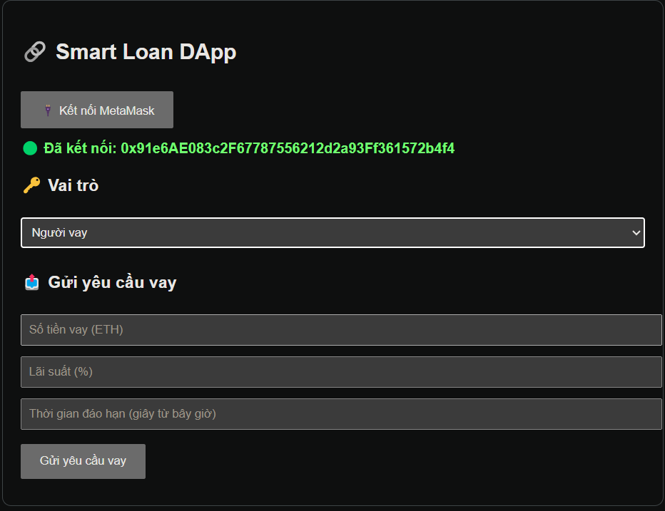

# 💼 Smart Loan DApp

**Smart Loan** là một ứng dụng phi tập trung (DApp) cho phép người dùng tương tác với hợp đồng thông minh trên mạng **Ethereum Sepolia Testnet** để tạo và chấp nhận các khoản vay một cách minh bạch và an toàn.

---

## 🎯 Chức năng chính

- ✅ Người vay có thể gửi yêu cầu vay tiền (số tiền, lãi suất, thời hạn).
- ✅ Người cho vay có thể xem danh sách yêu cầu và chọn chấp nhận.
- ✅ Sau khi khoản vay được chấp nhận, người vay có thể trả gốc + lãi.
- ✅ Cả hai bên đều có thể xem lịch sử khoản vay (dựa theo vai trò).
- ✅ Hỗ trợ nhiều khoản vay khác nhau, lưu trữ theo danh sách.

---

## ⚙️ Công nghệ sử dụng

- **Solidity (v0.8.x)**: viết smart contract
- **ethers.js**: tương tác với hợp đồng thông qua JavaScript
- **HTML/CSS/JS (Vanilla)**: giao diện frontend thuần
- **MetaMask**: ví kết nối để ký giao dịch
- **Sepolia Testnet**: blockchain test miễn phí

---

## 🚀 Cách chạy ứng dụng

### 1. Cài đặt các công cụ cần thiết

- [MetaMask Extension](https://metamask.io/)
- [Node.js](https://nodejs.org/) _(nếu dùng Vite hoặc live server)_

### 2. Triển khai hợp đồng thông minh

1. Truy cập [Remix IDE](https://remix.ethereum.org)
2. Tạo file `LoanContract.sol` và dán code từ `contracts/LoanContract.sol`
3. Compile với Solidity ^0.8.20
4. Deploy với **Injected Web3** → chọn mạng Sepolia
5. Lấy địa chỉ contract đã deploy

### 3. Cập nhật địa chỉ trong frontend

Mở file `index.html`, sửa dòng:

```js
const contractAddress =
	'0xYourDeployedContractAddress'
```

### 4. Mở giao diện frontend

- **Cách đơn giản:** dùng `Live Server` trong VS Code
- **Cách khác:** chạy bằng Vite hoặc mở `index.html` trực tiếp

---

## 📷 Giao diện mẫu



---

## 📄 Cấu trúc thư mục

```bash
.
├── index.html            # Giao diện chính
├── contracts/
│   └── LoanContract.sol  # Smart contract Solidity
├── smartloan.png         # Ảnh chụp giao diện
└── README.md             # Tài liệu mô tả
```

---

## 🧪 Một số ghi chú

- DApp hoạt động hoàn toàn trên **Testnet**, không dùng tiền thật.
- Sử dụng **MetaMask** để kết nối và gửi giao dịch (có ETH test).
- Có thể lấy ETH test từ: [https://sepoliafaucet.com](https://sepoliafaucet.com)

---

## 👨‍💻 Tác giả

- ✉️ [ngotrungduc74@gmail.com]
- 📅 Ngày tạo: 2024-2025
- 🛠 Dành cho mục đích học tập và thử nghiệm
